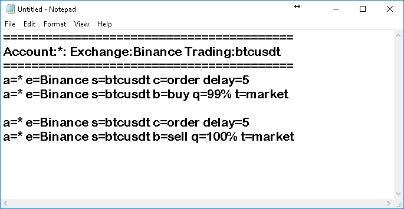

# Autoview Alert Generator:

Got fed up doing mistakes in copy/pasting autoview alerts, so I thought id try and automate the alert generation.

Simple AutoIT code to properly generate autoview alerts in notepad.

Download AutoIT at: https://www.autoitscript.com/site/autoit/downloads/

Script uses autoit Extended InputBox from: https://github.com/jesobreira/extinputbox_au3

Autoview_Alert_Generator.exe is the compiled version of the script.

